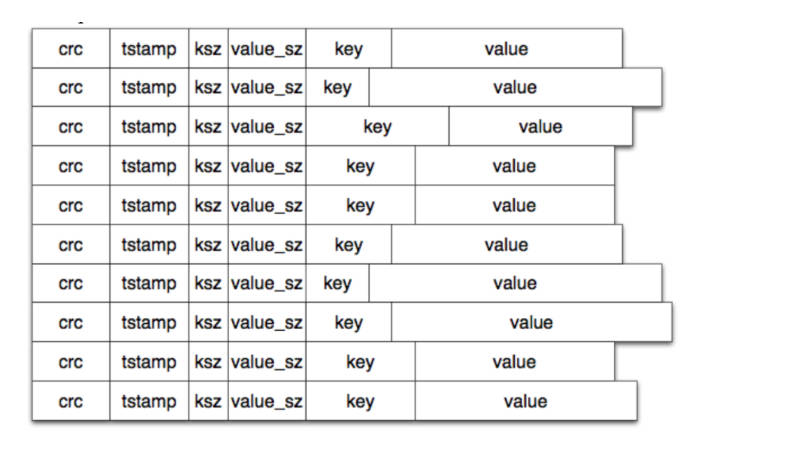

# go-bitcask
Efficient log-structured key-value storage engine, designed for low-latency read and write, high throughput and high reliability

```
/go-bitcask(暂定)
  ├── cmd
  │   └── go-bitcask-cli            # 命令行工具入口（可选）
  ├── internal
  │   ├── fio                   # 文件 I/O 管理
  │   │   ├── fio.go            # 文件操作接口定义
  │   │   ├── mmap.go           # MMAP 内存映射实现
  │   │   ├── asyncio.go       # 异步文件IO实现
  │   │   ├── manager.go        # 管理 ActiveFile 和 OldFiles
  │   │   └── sequential.go     # 顺序文件IO实现
  │   ├── index                 # 内存索引管理
  │   │   ├── btree.go          # B树索引实现
  │   │   ├── index.go          # 内存操作接口定义
  │   │   ├── shardmap.go      # 分片哈希表索引实现
  │   │   └── loader.go         # 数据文件索引重建
  │   ├── record                # 数据记录结构
  │   │   ├── record.go         # 记录结构定义 文件记录结构和内存索引定义
  │   │   └── validator.go      # CRC校验逻辑
  │   ├── codec                 # 编码解码
  │   │   ├── encoder.go        # 二进制编码
  │   │   └── decoder.go        # 二进制解码
  │   ├── merger                # 数据合并模块
  │   │    └── compact.go        # 合并旧文件，清理失效数据
  │   ├── keydir.go                 # 索引操作
  │   └── datafile.go             # 数据文件操作（Put/Get/Delete）
  ├── tests                     # 单元测试和压力测试
  ├── betch.go // 批处理
  ├── bitcask.go // 引擎初始化，对外暴露接口
  ├── errors.go // 错误定义
  ├── hint.go
  ├── iter.go // 迭代器
  ├── merge.go // 合并逻辑
  ├── options.go // 引擎配置
  ├── go.mod
  └── README.md
```
## 核心设计

1. 日志化存储(DataFile)
  - 将所有写操作以追加的方式记录到目前活跃的(ActiveFile)数据文件中
    - 数据文件格式: crc(4) + timestamp(8) + keySize(4) + valueSize(4)+ falg(1)  + key + value
  - 删除操作通过追加特殊墓碑值(Tombstone)实现逻辑删除，但不实际删除数据
2. 内存索引(KeyDir)
  - 内存中维护一个哈希表(ShardMap)，用于快速定位数据记录
  - 索引记录结构: Key + fileID + ValuePos + [timestamp + expireTime]
3. 数据合并(Compaction)
  - 定期将旧数据文件(OldFiles)合并成新的数据文件，清理无效数据
  - 合并结束后生成 `hint`文件，加速索引构建
4. 快速崩溃恢复
  - 重启时，从 `hint`文件中加载索引，快速恢复内存索引，避免全量扫描数据文件

## entry

### data entry

文件日记记录：
```
header[19] = CRC(4) + Timestamp(8) + KeySize(2) + ValueSize(4) + Deleted(1)

| header  | Key(N) | Value(M) |

// DataEntry 文件日志记录结构
type DataEntry struct {
	CRC       uint32 // crc校验码(Header + Key + Value)
	Timestamp uint64 // 时间戳 (unix时间戳)
	Key       []byte
	Value     []byte
	Delete    bool
}
```
- `CRC`：校验范围除 CRC 字段以外的所有字段，用于校验数据是否损坏


> tcask 论文提供的结构如下:
>
> 

###  Index


### ShardMap


ShardMap 是一个基于go原生map实现的分片哈希结构，用于快速定位数据记录

- 分片设计原理
  - `减少锁竞争` 全局map拆分成多个独立分片(shard)，每个分片持有自己的锁，减少锁颗粒度
  - `哈希定位` 每个分片使用一致性哈希算法，将key映射到分片，减少冲突
  - `读写分离` 使用sync.RWMutex读写锁，允许并发读，写互斥

> 分片map的相关资料
> - https://github.com/orcaman/concurrent-map
> - https://github.com/HDT3213/godis/blob/master/datastruct/dict/concurrent.go
> - https://github.com/jianghushinian/blog-go-example/tree/main/sync/map/concurrent-map


## Inspired

- [mini-bitcask](https://github.com/rosedblabs/mini-bitcask.git)
- [bitcask](https://git.mills.io/prologic/bitcask)